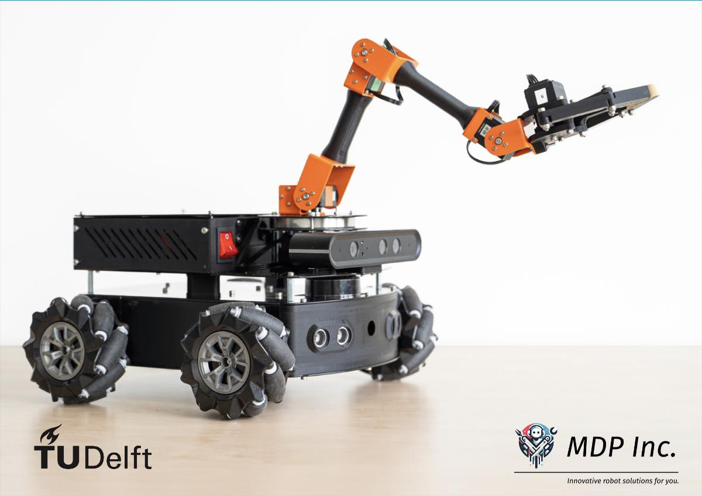

  
*Image by Chris Pek*

# Mirte Master workshop

Welcome to the Mirte Master workshop! Maybe, you have just assembled your own Mirte Master using our open-source designs. More likely, you are participating in a workshop and have been told to visit this page. Anyhow, you are about to give your Mirte Master its first abilities!

## 1. Getting started
### 1.1 Preparations
 

#### 1.1.3 Battery Safety WARNING
**Very important**:
- The battery will break when over-discharged.
- As long as the robot doesn't need to drive, keep it connected to the charger.

> [!WARNING]  
> Never let the battery percentage go below 10%.

As long as ROS is running, it will check battery level and automatically shut down below 10%. Without ROS running, be extremely careful.

### 1.2. Connecting

#### 1.2.1 Connect to the WiFi
<!-- Needs to be gone -->
<!-- The rear display shows a WiFi network name, `Mirte-XXXXXX`. Connect to it with your laptop (**Password**: `mirte_mirte`). -->
Connect your the laptop to the same network as the robot.

**SSID**: `Martijn`
**Password**: `martijn2024`  

#### 1.2.2 Navigate to the control interface
Open a browser on your laptop and go to the website "http://192.168.XXX.YYY:8000/?folder=/home/mirte/mirte_ws" (See the back display for the exact IP-adress)

**Username**: `mirte`  
**Password**: `martijn2024`  

You should see the VS Code web editor, a powerful tool to program robots.

> [!TIP]  
> In the bottom left, you can modify "Themes" --> "Color Theme" for better visibility.

### 1.3. First login

In the VS Code web editor, open a new terminal(<kbd>Ctrl</kbd>+<kbd>j</kbd>). You can try doing running a `neofetch` to get some system information.
Make sure your whole group is connected.

### 1.4. First Linux and ROS tests
Once you have a terminal, let's refresh your linux skills. For example:

| Command|  |
|:-------|--|
| `ls` | shows the list of files and folders inside the current folder |
| `cd folder_name` | will change to folder_name |
| `cd ..` | will change one folder up |
| `python3` | will start an interactive Python session, exit with `>>> exit()` |
| <kbd>Tab</kbd> | will autocomplete your command, very useful to prevent typos |

Let's test that ROS is already running. For example:

| Command|  |
|:-------|--|
| `rosnode list` | shows all ROS nodes that are currently running |
| `rostopic list` | shows all topics that exist |
| `rostopic echo /topic_name` | displays the messages being sent over `/topic_name` (e.g. `/arm/joint_states`) |
| <kbd>Ctrl</kbd>+<kbd>c</kbd> | stops the last command |
| `rosservice list` | shows all available ROS services |

### 1.5. First robot motions
Driving is controlled through the topic `/mobile_base_controller/cmd_vel`.

> [!CAUTION]  
> Lift up the robot before trying, so that it doesn't drive off the table!
> Multiple commands at the same time might make it move strangely.

Try the following command.
After pressing <kbd>Tab</kbd> twice, change the `linear.x` value to `0.3` and press <kbd>Enter</kbd> to publish the message:

```console
rostopic pub /mobile_base_controller/cmd_vel <tab> <tab>
```

Stop the publisher with <kbd>Ctrl</kbd>+<kbd>c</kbd>.

The robot keeps driving if the message keeps being repeated, with the `-r` (`--rate`) option.
After pressing <kbd>Tab</kbd> twice, change the `x` value to `0.3` again and press <kbd>Enter</kbd> to publish the message:

```console
rostopic pub -r 10 /mobile_base_controller/cmd_vel <tab> <tab>
```

Check the messages with `rostopic echo` in another terminal.

Stop the publisher with <kbd>Ctrl</kbd>+<kbd>c</kbd>.


### 1.6. First launch of an additional ROS node: driving around!
Driving is easier through keyboard teleoperation. This is available in a ROS node that is not currently running.
`roslaunch mirte_teleop teleopkey.launch` will start keyboard teleoperation.

Use the <kbd>x</kbd> and <kbd>c</kbd> keys to tone down linear velocity to `0.3` and angular velocity to `0.6`.

Drive, and in a different terminal check out `rostopic echo /mobile_base_controller/cmd_vel`

## 2. Running the workshop software on the robot

### 2.1 Testing
Let's test if it all works with the very underwhelming command

```console
rosrun mirte_workshop mirte_keyboard.py
```

It works if there are no errors, and if you see the characters that you type, back on the screen. Check the Python code to find out which new topic has been created; you can see the same characters when you echo that topic.

### 2.2. Launching mirte_workshop specific configuration
When you turned on the robot, ROS was automatically started. However:
- This is not exactly the right configuration for the workshop, and
- It doesn't show screen output, so we don't know what is going on

Stop the invisible ROS instance:

```console
sudo service mirte-ros stop
```

Now start the right one with:

```console
roslaunch mirte_workshop mirte_workshop.launch
```
> [!WARNING]  
> This needs to be done once on every robot (coordinate!) and at every robot reboot.

The screen will show which nodes are being started. It will also show error messages, if any. Once launched, you can no longer use this terminal, and <kbd>Ctrl</kbd>+<kbd>c</kbd> will stop ROS. Therefore, open new terminals to run additional commands.

## 3. Get all the components ready
Here are six workshop modules. The best way to work through them is to assign each module cluster to a different duo of team members.

### [1. Arm and gripper](arm_and_gripper.md)

---

### [2. Launch files](launch_files.md)

### [3. Keyboard control](keyboard_control.md)

----

### [4. RViz](rviz.md) *requires laptop/desktop with ROS noetic*

----

### [5. Navigation](navigation.md)

### [6. Markers](markers.md)

## 4. Make a delivery robot
Put all the components together. You are free to create your own scenario. Here is one option:
- At the press of one key (e.g., '1'), drive to a location and deliver a package
- At the press of another key, drive to a second location and deliver a package
- At the press of a third key, go back to the home position (to collect more packages)
