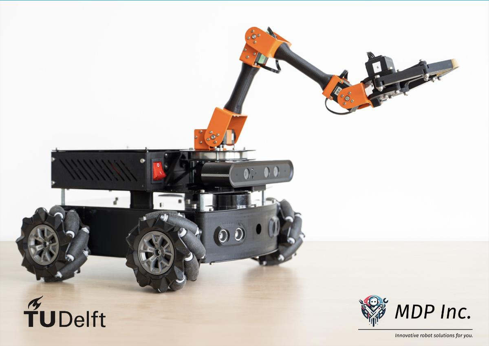

  
*Image by Chris Pek*

# Mirte Master workshop (ROS2 version)

Welcome to the Mirte Master workshop! Maybe, you have just assembled your own Mirte Master using our open-source designs. More likely, you are participating in a workshop and have been told to visit this page. Anyhow, you are about to give your Mirte Master its first abilities!

## 1. Getting started
### 1.1 Preparations

#### 1.1.1 Before switching on the robot, make sure that:
- your Mirte Master has a fresh image containing its basic software,
- the battery is sufficiently well charged,
- the arm is pointing more or less upward.
*note: if the robot is already on, you cannot move the arm any more. Don't try too hard, it might break.*

#### 1.1.2 Switching Mirte on
- Switch it on, and
- wait until text appears on the little rear display.
- As long as the robot doesn't need to drive, keep it connected to the charger.

#### 1.1.3 Battery Safety WARNING
**Very important**:
The battery will break when over-discharged.

> [!WARNING]  
> Never let the battery percentage go below 10%.

As long as ROS is running, it will check battery level and automatically shut down below 10%. Without ROS running, be extremely careful.

### 1.2. Connecting

#### 1.2.1 Connect to the WiFi
The rear display shows a WiFi network name, `Mirte-XXXXXX`. Connect to it with your laptop (**Password**: `mirte_mirte`).

> [!NOTE]  
> You will lose internet access, unless your laptop has another (fi: wired) internet connection.

#### 1.2.2 Navigate to the control interface
Open a browser on your laptop and go to the website "http://192.168.42.1:8000"

**Username**: `mirte`  
**Password**: `mirte_mirte`  

You should see the VS Code web editor, a powerful tool to program robots.

> [!TIP]  
> In the bottom left, you can modify "Themes" --> "Color Theme" for better visibility.

### 1.3. First login

In the VS Code web editor, open a new terminal. One team member should change the default password through the command
`passwd`

> [!NOTE]  
> In Linux, you don't see what you type in the password field, this is for improved security.

Carefully read the response on the screen. Share the new password with your team members. They can now log in simultaneously from their own laptops.

### 1.4. First Linux and ROS tests
Once you have a terminal, let's refresh your linux skills. For example:

| Command|  |
|:-------|--|
| `ls` | shows the list of files and folders inside the current folder |
| `cd folder_name` | will change to folder_name |
| `cd ..` | will change one folder up |
| `python3` | will start an interactive Python session, exit with `>>> exit()` |
| <kbd>Tab</kbd> | will autocomplete your command, very useful to prevent typos |

Let's test that ROS is already running. For example:

| Command|  |
|:-------|--|
| `ros2 node list` | shows all ROS nodes that are currently running |
| `ros2 topic list` | shows all topics that exist |
| `ros2 topic echo /topic_name` | displays the messages being sent over `/topic_name` (e.g. `/arm/joint_states`) |
| <kbd>Ctrl</kbd>+<kbd>c</kbd> | stops the last command |
| `ros2 service list` | shows all available ROS services |

### 1.5. First robot motions
Driving is controlled through the topic `/mirte_base_controller/cmd_vel`.

> [!CAUTION]  
> Lift up the robot before trying, so that it doesn't drive off the table!

Try the following command.

```bash
ros2 topic pub /mirte_base_controller/cmd_vel geometry_msgs/msg/Twist "{linear: {x: 0.3, y: 0.0, z: 0.0}, angular: {x: 0.0, y: 0.0, z: 0.0}}" --once
```

Instead of the option `--once`, you can also tell it to repeat for continuous driving with `-r` (`--rate`) option. Try the following command.

```bash
ros2 topic pub /mirte_base_controller/cmd_vel geometry_msgs/msg/Twist "{linear: {x: 0.3, y: 0.0, z: 0.0}, angular: {x: 0.0, y: 0.0, z: 0.0}}" -r 10
```

Check the messages with `ros2 topic echo` in another terminal.

Stop the publisher with <kbd>Ctrl</kbd>+<kbd>c</kbd>.


### 1.6. First launch of an additional ROS node: driving around!
Driving is easier through keyboard teleoperation. This is available in a ROS node that is not currently running.

`ros2 launch mirte_teleop teleop_key.launch.py` will start keyboard teleoperation.

Use the <kbd>x</kbd> and <kbd>w</kbd> keys to adjust linear velocity and <kbd>c</kbd> and <kbd>e</kbd> to adjust angular velocity.

Drive, and in a different terminal check out `ros2 topic echo /mirte_base_controller/cmd_vel`

## 2. Getting the workshop software on the robot
### 2.1. Folder structure
Not all required software is on the robot yet. Before fixing that, you need to familiarize yourself with the overall folder structure. Browse folders in the left panel of VS Code. The important part of the structure is:

```
📁 /home
└── 📁 mirte
    └── 📁 mirte_ws
        ├── 📁 build
        ├── 📁 devel
        └── 📁 src
            ├── 📁 mirte_navigation
            ├── 📁 mirte_workshop
            ├── 📁 mirte-ros-packages
            ├── 📁 ros2_astra_camera
            ├── 📁 rplidar_ros
            ├── 📁 usb_cam
            ├── 📁 web_video_server
```

**The packages `mirte_navigation` and `mirte_workshop` don't exist yet**. We need to get them from GitHub, for which we need an internet connection.

### 2.2. Connecting the robot to internet
Make sure that there is a WiFi network that you have control over. For example, use your phone as a hotspot.

The following command will connect your robot (use the correct SSID and PASSWORD):

```bash
nmcli device wifi connect "SSID" password "PASSWORD"
```

If this does not work, you can change the WiFi using the web interface at http://192.168.42.1, under the "Settings" tab. However, this page only lists the SSIDs that were available when the robot booted, so in the worst case you'll need to first turn on your WiFi network, reboot the robot, and then access this web interface.

As soon as the robot is connected to the WiFi network, you will lose the direct connection to it. To get back in touch:
- Connect your laptop to the same WiFi network
- Find the robot's IP address from your phone hotspot
- Use this IP address in the browser

### 2.3. Cloning the GitHub repositories

#### 2.3.1 Clone this repository
You are reading this on GitHub. If you scroll up, there is a list of folders and files that together are the package `mirte_workshop`. With the green button that says `<> Code`, copy the https address of the repository. Then use the following commands to copy it onto your robot:

```bash
cd ~/mirte_ws/src
git clone --branch ROS2 <...>
```

Replace `<...>` with the https address of the repository. Paste it using a right mouse click, or use <kbd>Ctrl</kbd>+<kbd>Shift</kbd>+<kbd>v</kbd>.


#### 2.3.2 Clone the navigation repository
Find the repository [MartijnWisse/mirte_navigation](https://github.com/MartijnWisse/mirte_navigation) on GitHub and clone that onto the robot as well.


### 2.4. Compiling new packages

#### 2.4.1 Compile
Whenever you git clone a new package onto the robot, it needs to be compiled so that ROS can find and use it. For example:

```bash
cd ~/mirte_ws
colcon build --symlink-install --packages-select mirte_navigation
colcon build --symlink-install --packages-select mirte_workshop
```

#### 2.4.2 Refresh Environment
Now, in any new terminal, ROS will know how to find the new folders and files. But not in terminals that already exist. To tell them, in each existing terminal you need to type:

```bash
source install/setup.bash
```

Alternatively, you can close the terminal(s) and open new ones.

#### 2.4.3 Testing
Let's test if it all works with the very underwhelming command

```bash
ros2 run mirte_workshop mirte_keyboard.py
```

It works if there are no errors, and if you see the characters that you type, back on the screen. Check the Python code to find out which new topic has been created; you can see the same characters when you echo that topic.

### 2.5. Launching mirte_workshop specific configuration
When you turned on the robot, ROS was automatically started. However:
- This is not exactly the right configuration for the workshop, and
- It doesn't show screen output, so we don't know what is going on

Stop the invisible ROS instance:

```bash
sudo service mirte-ros stop
```

Now start the right one with:

```bash
roslaunch mirte_workshop mirte_workshop.launch
```

The screen will show which nodes are being started. It will also show error messages, if any. Once launched, you can no longer use this terminal, and <kbd>Ctrl</kbd>+<kbd>c</kbd> will stop ROS. Therefore, open new terminals to run additional commands.

## 3. Get all the components ready
Here are six workshop modules. The best way to work through them is to assign each module to a different team member.

### [1. Arm and gripper](arm_and_gripper.md)

### [2. Launch files](launch_files.md)

### [3. Keyboard control](keyboard_control.md)

### [4. Navigation](navigation.md)

### [5. RViz](rviz.md) *requires laptop/desktop with ROS noetic*

### [6. Markers](markers.md)

## 4. Make a delivery robot
Put all the components together. You are free to create your own scenario. Here is one option:
- At the press of one key (e.g., '1'), drive to a location and deliver a package
- At the press of another key, drive to a second location and deliver a package
- At the press of a third key, go back to the home position (to collect more packages)
