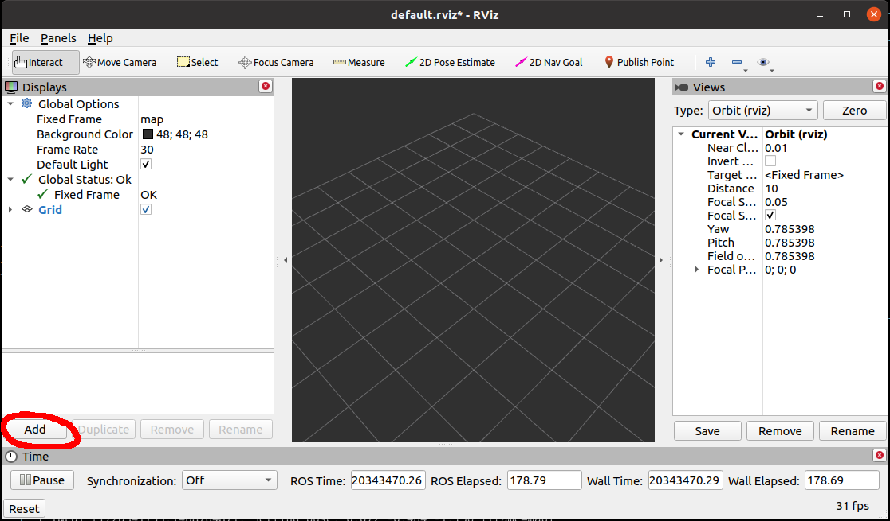

# RViz2

This module must be executed on a computer that has ROS2 Humble installed, because RViz2 requires graphics which Mirte Master cannot display.

## 1. Preventing errors with multiple robots in the same network
All ROS2 nodes are visible to all computers (and robots) in the same network, provided that they use the same `ROS_DOMAIN_ID` value. We want the computer and your Mirte Master to use the same `ROS_DOMAIN_ID`, and we want this to differ from all other Mirte Masters in the same network.   

In a terminal in the robot, type:
```bash
echo $ROS_DOMAIN_ID
```
The value should exist and be non-zero.

<details>
<summary>If there is no value shown:</summary>

Edit the `~/.mirte_settings.sh` file and add the following line to the end:

```bash
export ROS_DOMAIN_ID=<robot_number>
``` 

Restart the robot `sudo reboot now` for all systems to have the correct settings.

</details>


Then, in the ROS2 Humble computer, open the file `~/.bashrc`, and add the following line:
```bash
export ROS_DOMAIN_ID=<put_here_the_correct_number>
```

and run

```bash
source ~/.bashrc
```

We can partially test if it set correctly with  
`ros2 topic list`, but the real testing is done below, when working with RViz2.


## 2. Launch RViz2
In the ROS2 Humble computer, type
```bash
rviz2
```
The following screen will pop up:

  

## 3. Show relevant things
Through the 'add' button (encircled in the image above), try to add the following visualizations:

| display type | topic (select in 'Displays' pane) | visualization |
|:-------------|-----------------------------------|---------------|
| Map | /map | shows the map created by gmapping or published by map_server |
| Laserscan | /scan | shows the lidar sensor data |
| TF | Frames 'base_link' and 'map' | shows the coordinate frames |
| Image | /camera/color/image_raw (Transport Hint 'compressed') | shows the front camera image |
| MarkerArray | /stored_points_markers | Only works if `marker_publisher.py` is running. Shows stored locations

Some things only work properly if you set the parameter 'Fixed Frame' to 'map', under 'Global Options' (top left of screen). However, initially you should set 'Fixed Frame' to 'base_link'.

Every time you select an item from a drop-down menu, hit the <kbd>Enter</kbd> key.

## 4. Save configuration
To prevent having to set all these things again, save the RViz config with *File* -> *Save Config*. 
